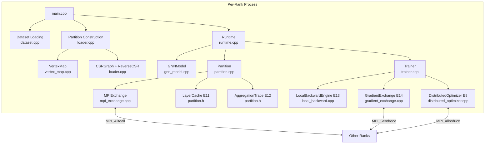
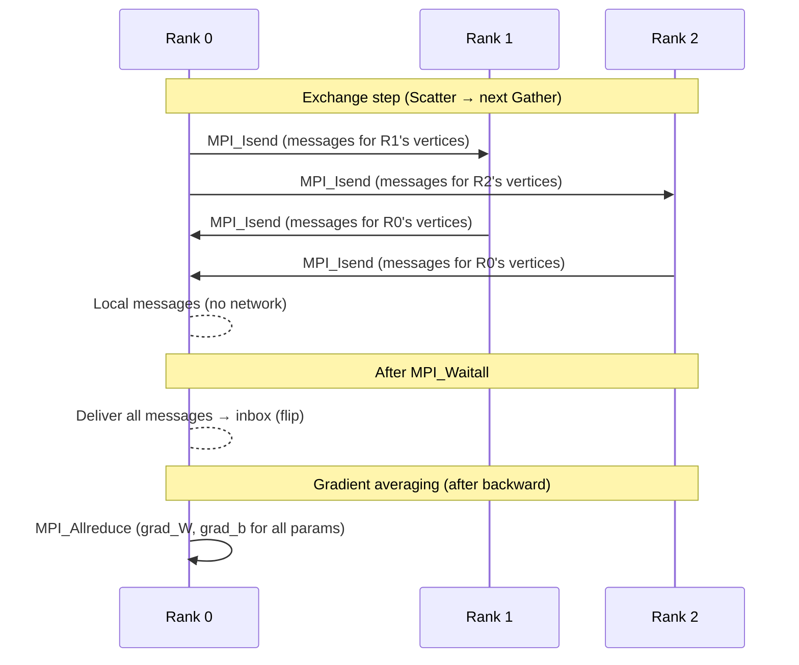

# 01 — Architecture

> See also: [00_REPOSITORY_OVERVIEW.md](00_REPOSITORY_OVERVIEW.md) | [02_EXECUTION_FLOW.md](02_EXECUTION_FLOW.md) | [04_DATA_STRUCTURES.md](04_DATA_STRUCTURES.md)

---

## System Overview

The system is a **vertex-centric distributed GNN runtime**. Every node in the MPI cluster runs an identical copy of the program. Each MPI process (called a **rank**) owns a subset of the graph's vertices and edges. Ranks communicate exclusively via explicit MPI calls.

The design philosophy: **think like a graph runtime, not like a tensor runtime.** Vertex ownership, message routing, and frontier activation are first-class concepts. PyTorch tensors are used only for math and parameter storage — not for data flow control.

---

## Major Subsystems



---

## Execution Model

The runtime follows the **BSP (Bulk Synchronous Parallel) / Pregel** model:

```
For each GNN layer:
    ┌─────────────────────────────────┐
    │  SUPERSTEP                      │
    │                                 │
    │  1. GATHER                      │
    │     Read inbox messages         │
    │     Sum payloads → aggr_buf     │
    │                                 │
    │  2. COMPUTE                     │
    │     aggr_buf @ W.T + b → pre    │
    │     ReLU(pre) → hidden_next     │
    │                                 │
    │  3. SCATTER                     │
    │     For each out-neighbor u:    │
    │       emit Message(hidden_next) │
    │                                 │
    │  4. MPI EXCHANGE                │
    │     Deliver local messages      │
    │     MPI_Isend/Irecv remotes     │
    │     Wait → fill inbox           │
    └─────────────────────────────────┘
         ↓ advance_hidden(), advance_frontier()
         next layer
```

This loop is **completely fixed** and is never modified. All extensions (E11 caching, E12 tracing) are **side effects of the Gather and Exchange steps** — they do not change execution order.

---

## MPI Model



### Three types of MPI communication in the system

| Type | When | Call | File |
|---|---|---|---|
| **Forward exchange** | After each Scatter | `MPI_Alltoall` (counts) + `MPI_Isend`/`Irecv` | `mpi_exchange.cpp` |
| **Backward gradient** | After `loss.backward()` | `MPI_Sendrecv` per rank pair | `gradient_exchange.cpp` |
| **Gradient averaging** | Before `optimizer.step()` | `MPI_Allreduce` | `distributed_optimizer.cpp` |

---

## Partition Model

Each MPI rank owns one **Partition** object. A Partition is the rank's complete local universe:

```
Partition (per rank)
├── CSRGraph               — local outgoing edges (global dst IDs)
├── ReverseCSR             — local incoming edges (global src IDs) [E12]
├── VertexMap              — global↔local ID translation, owner_rank()
├── hidden_curr [N, H]     — current layer embeddings (read-only during superstep)
├── hidden_next [N, H]     — next layer embeddings (write-only during superstep)
├── aggr_buf    [N, H]     — aggregation buffer (Gather result)
├── frontier_curr          — bitset of active vertices this layer
├── frontier_next          — bitset of active vertices next layer
├── InboxBuffer            — double-buffered incoming message store
├── thread_outboxes[]      — per-thread outgoing message queues
├── MPIExchange            — communication layer
├── layer_cache[]          — one LayerCache per executed layer [E11]
├── aggr_traces[]          — one AggregationTrace per layer [E12]
└── vertex_state[]         — per-vertex active flag
```

**Key invariant:** No rank directly reads or writes another rank's Partition. All inter-rank communication goes through MPI.

---

## Ownership Model

The ownership model is fully determined at startup through `VertexMap`:

```
Global vertex ID → owner rank:
   range_start[r] ≤ global_id < range_start[r+1]  →  owned by rank r

Local vertex ID:
   local_id = global_id - range_start[owner_rank]

Translation functions (vertex_map.cpp):
   owner_rank(global_id)        — binary search on range_start[]
   to_local(global_id)          — global_id - range_start[owner]
   to_global(local_id, rank)    — range_start[rank] + local_id
   local_count(rank)            — range_start[rank+1] - range_start[rank]
```

The VertexMap is **immutable after init**. All rank/local lookups throughout the system (including both forward MPIExchange and backward GradientExchange) use these same functions.

---

## Message Flow (Forward)

```
Each active vertex v (local):
  for each out-neighbor u in CSRGraph:
    Message { src=global(v), dst=global(u), payload=hidden_next[v] }
    → thread_outboxes[tid].push(msg)

Merge:
  for each outbox: MPIExchange.enqueue(msg)
    if owner(msg.dst) == this rank: → local_pending
    else:                           → remote_pending

MPIExchange.exchange():
  MPI_Alltoall(send_counts → recv_counts)
  MPI_Isend(send_bufs[r]) for each remote rank r
  MPI_Irecv(recv_bufs[r]) for each remote rank r

MPIExchange.wait_and_unpack(inbox, &trace):
  MPI_Waitall
  for each remote message m:
    [E12] trace.remote_contributors[to_local(m.dst)].push_back(m.src)
    m.dst = to_local(m.dst)
    inbox.write(m)
  for each local message m:
    m.dst = to_local(m.dst)
    inbox.write(m)
  inbox.flip()   ← old buffer cleared
```

Wire format per message: `[src:int32][dst:int32][payload:float×H]` stored as floats (stride = 2 + H floats).

---

## Separation of Concerns

| Component | Responsibility | Does NOT do |
|---|---|---|
| `Runtime` | Layer loop orchestration, lifecycle | Math, training, MPI details |
| `SuperstepExecutor` | Gather, Compute, Scatter per layer | Routing, backprop |
| `ComputeEngine` | Aggregation, linear, ReLU (raw pointers) | Autograd, communication |
| `MPIExchange` | Message serialization, sending, receiving | Message creation, gradient math |
| `GNNModel` | Parameter ownership, parameter list | Execution, gradients |
| `Trainer` | Loss, backward, optimizer | Forward execution, MPI exchange |
| `LocalBackwardEngine` | Local gradient reconstruction | MPI, forward |
| `GradientExchange` | Remote gradient delivery | Forward, parameter updates |
| `DistributedOptimizer` | Gradient averaging via MPI | Loss, backward |

This strict separation means you can modify backward logic without touching forward execution, and vice versa.

---

## The Non-Differentiability Invariant

The most important architectural fact: **the forward runtime is deliberately non-differentiable**.

Message payloads are `std::vector<float>` — PyTorch autograd cannot track gradients through them. The aggregation loop inside `superstep.cpp` operates on raw float pointers extracted from tensors via `.data_ptr<float>()`.

This means:
- Forward pass: uses MPI for data movement, executes correctly
- Backward pass: **cannot be done by PyTorch autograd alone**. Gradients must be reconstructed manually (E13/E14) or through computation trees (future E16)

This is not an accident or a bug. It is a deliberate architectural choice that enables explicit control over distributed gradient computation.

---

## Cross-References

- Data structures detail → [04_DATA_STRUCTURES.md](04_DATA_STRUCTURES.md)
- MPI communication detail → [05_MPI_COMMUNICATION.md](05_MPI_COMMUNICATION.md)
- Forward pass detail → [06_FORWARD_PASS.md](06_FORWARD_PASS.md)
- Backward pass detail → [07_BACKWARD_PASS.md](07_BACKWARD_PASS.md)
