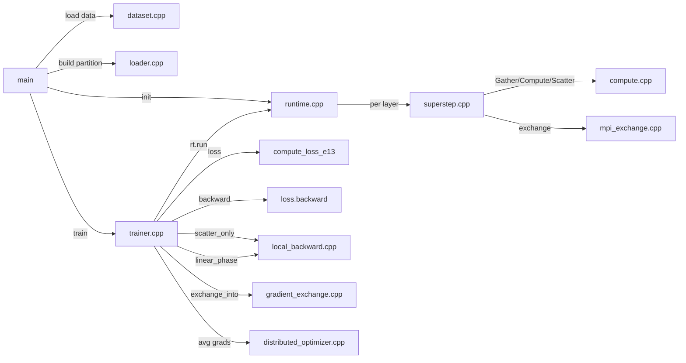

# 02 — Execution Flow

> See also: [01_ARCHITECTURE.md](01_ARCHITECTURE.md) | [06_FORWARD_PASS.md](06_FORWARD_PASS.md) | [07_BACKWARD_PASS.md](07_BACKWARD_PASS.md)

---

## Complete Execution Sequence

This document traces one complete execution of the program from `main()` to shutdown.

---

## Phase 1 — MPI Initialization (`main.cpp`)

```
MPI_Init(&argc, &argv)
MPI_Comm_rank(MPI_COMM_WORLD, &rank)
MPI_Comm_size(MPI_COMM_WORLD, &world_size)
```

Every rank runs the same binary. After initialization, each rank knows its `rank` ID (0..world_size-1) and the total `world_size`. The `RunConfig` struct is populated with these values plus CLI parameters.

Key CLI arguments:
- `--dataset-root <path>` — use OGBN-Products dataset from this directory
- `--partition vertex|edge|hybrid` — choose partitioning strategy
- `--partition-alpha`, `--partition-beta` — hybrid cost model weights

---

## Phase 2 — Dataset Loading (`dataset.cpp`)

```
Dataset dataset = load_ogbn_products(dcfg)
```

**What happens:**
1. Read `node-feat.csv.gz` → `dataset.features  [N, 100]` float32 tensor
2. Read `node-label.csv.gz` → `dataset.labels     [N]` int64 tensor
3. Read `edge.csv.gz` → `dataset.edge_src[], dataset.edge_dst[]` vectors
4. Read `train/valid/test.csv.gz` → `dataset.train_mask[], val_mask[], test_mask[]`

**Important:** All ranks read the full dataset from disk. There is no MPI broadcast of dataset data — each rank reads independently and holds a full copy in memory. This is a limitation of the current loader; future work may broadcast from rank 0.

**Debug print:** Only rank 0 prints dataset summary statistics (BUG 2 FIX in main.cpp).

---

## Phase 3 — Partition Construction (`loader.cpp`)

```
Partition p = load_partition_from_dataset(dataset, cfg)
```

This is where the graph is divided across ranks.

```
Call graph:
load_partition_from_dataset()
  ├── Compute vertex degrees from edge_src[]
  ├── VertexMap::init_edge_balanced() or init_hybrid_balanced() or init()
  │     → range_start[0..world_size] determines vertex ownership
  ├── Filter edges: keep only edges where owner_rank(src) == this rank
  ├── Build local CSRGraph (local_src → global_dst)
  ├── Partition::init(local_n, hidden_dim, ...)
  │     ├── Allocate hidden_curr [local_n, H] = zeros
  │     ├── Allocate hidden_next [local_n, H] = zeros
  │     ├── Allocate aggr_buf    [local_n, H] = zeros
  │     ├── frontier_curr.init(local_n)  — all vertices active
  │     └── MPIExchange.init(vertex_map, rank, world_size, H)
  └── build_reverse_csr(p)          ← E12: local in-edges
```

After `Partition::init()`, if a dataset is present, `Runtime::init()` copies dataset features into `hidden_curr`:
```
for each local vertex lv:
    gv = vertex_map.to_global(lv, rank)
    hidden_curr[lv] = dataset.features[gv]    ← feature initialization
```

---

## Phase 4 — Runtime Startup (`runtime.cpp`)

```
Runtime rt;
rt.init(cfg, mcfg, std::move(p), &dataset)
```

`Runtime::init()`:
1. Stores the `RunConfig` and `ModelConfig`
2. Moves the `Partition` into the runtime (single ownership)
3. Calls `model.init(mcfg)` — initializes `GNNLayer` objects:
   - Each layer: `W = eye(H)`, `b = zeros(H)` — identity initialization
   - Classifier head: `classifier_W [num_classes, H]`, `classifier_b [num_classes]`

If a `--load` path was given, `Checkpoint::load_checkpoint()` restores saved model weights.

---

## Phase 5 — Training Loop (`trainer.cpp`)

```
Trainer trainer(rt, tcfg, &dataset);
trainer.train();
```

The outer training loop:
```
for epoch = 0..epochs-1:
    ① rt.run()              ← forward pass (all layers)
    ② compute_loss_e13()    ← reconstruct differentiable graph
    ③ loss.backward()       ← PyTorch autograd (last layer only)
    ④ E13/E14 backward      ← manual gradient reconstruction
    ⑤ optimizer.average_gradients()   ← MPI_Allreduce
    ⑥ optimizer.step()      ← parameter update
    eval metrics
    early stopping check
```

---

## Phase 6 — Forward Pass (`runtime.cpp::run()`, `superstep.cpp::run()`)

```
rt.run():
  partition.layer_cache.clear()          ← E11: clear from previous epoch
  partition.aggr_traces.assign(num_layers, AggregationTrace{})  ← E12

  executor.seed(partition, &timing)      ← Bootstrap scatter (layer -1 → layer 0 inbox)

  for layer = 0..num_layers-1:
    MPI_Allreduce(local_active → global_active)  ← all ranks exit together
    if global_active == 0: break

    executor.run(partition, model.layer(layer), layer, &timing)
      ├── GATHER: for each active v: aggr_buf[v] = sum(inbox[v].payloads)
      │     LayerCache[layer].aggregated = aggr_buf.clone()       ← E11
      │     [E12] cache.aggr_meta.type = SUM
      ├── COMPUTE: for each active v: pre[v] = W@aggr[v]+b; h_next[v]=relu(pre[v])
      │     LayerCache[layer].pre_activation = pre                ← E11
      │     LayerCache[layer].activated = h_next.clone()          ← E11
      ├── SCATTER: for each active v, each out-neighbor u: emit Message(h_next[v])
      ├── MPIExchange.exchange()         ← MPI_Isend/Irecv
      ├── MPIExchange.wait_and_unpack(inbox, &aggr_traces[layer])
      │     ↑ E12: captures remote_contributors during unpack
      ├── LayerCache[layer].active_mask = frontier_curr_mask      ← E11
      └── partition.layer_cache.push_back(cache)

    partition.advance_hidden()           ← swap hidden_curr/hidden_next
    partition.advance_frontier()         ← swap frontier_curr/frontier_next
    mpi_exchange.increment_superstep()
```

---

## Phase 7 — Backward Pass (`trainer.cpp`)

### Step 7a — Reconstruct last-layer computation graph (`compute_loss_e13()`)

```
aggr_last = partition.layer_cache[last_layer].aggregated
              .detach().requires_grad_(true)
aggr_last.retain_grad()

out = relu(aggr_last @ model.layer(last_layer).W().t() + b)
logits = out @ classifier_W.t() + classifier_b
loss = cross_entropy(logits[train_mask], labels[train_mask])

                                    ← debug: GLOBAL_AGGR_SUM, GLOBAL_LABEL_SUM,
                                       GLOBAL_LOGITS_SUM are printed here
```

### Step 7b — PyTorch autograd backward

```
loss.backward()
// Now: aggr_last.grad = ∂L/∂aggr[last_layer]   [N, H]
// Also: model.layer(last).W.grad defined
//       model.classifier_W.grad defined
//       (debug: GLOBAL_GRAD_AGGR is printed here)
```

### Step 7c — E13 Local scatter (local edge contributions)

```
grad_h_local = LocalBackwardEngine::scatter_only(partition, last_layer, aggr_last.grad)
// For each local in-edge v→u (via ReverseCSR):
//   grad_h_local[u] += aggr_last.grad[v] * active_mask[v]
```

### Step 7d — E14 Remote gradient delivery

```
GradientExchange grad_ex(rank, world_size, chunk_pairs);
grad_ex.exchange_into(partition, last_layer, aggr_last.grad, grad_h_local)
// For each remote rank r:
//   Send: grad_aggr[v] for each v with contributors from r
//   Recv: grad contributions from other ranks
//   Accumulate into grad_h_local[u] += received[u]
// After: grad_h_local contains BOTH local and remote contributions
```

### Step 7e — E13 linear_phase (parameter gradients for layer 0)

```
[grad_W0, grad_b0] = LocalBackwardEngine::linear_phase(partition, src_layer=0, grad_h_local)
// relu_mask = (LayerCache[0].pre_activation > 0)  [N, H]
// grad_pre  = grad_h_local * relu_mask
// grad_W0   = grad_pre.T @ LayerCache[0].aggregated
// grad_b0   = grad_pre.sum(0)

// Assign back to model parameters:
model.layer(0).W().mutable_grad() = allreduce(grad_W0)
model.layer(0).b().mutable_grad() = allreduce(grad_b0)
```

---

## Phase 8 — Gradient Averaging and Optimizer Step

```
DistributedOptimizer::average_gradients():
    for each parameter p in model.parameters():
        MPI_Allreduce(p.grad, MPI_SUM)
        p.grad /= world_size

optimizer->step():
    for each parameter p:
        p.data -= lr * p.grad       ← SGD update
        (or Adam momentum update)
```

After this step, **all ranks have identical model weights**. The next epoch begins with a consistent model across the cluster.

---

## Phase 9 — Shutdown

```
rt.print_summary()       ← per-rank + global stats, timing breakdown
MPI_Finalize()
return 0
```

---

## Call Graph Summary



---

## Cross-References

- Forward pass detail → [06_FORWARD_PASS.md](06_FORWARD_PASS.md)
- Backward pass detail → [07_BACKWARD_PASS.md](07_BACKWARD_PASS.md)
- MPI communication → [05_MPI_COMMUNICATION.md](05_MPI_COMMUNICATION.md)
- Debug outputs during this flow → [09_VALIDATION_AND_DEBUGGING.md](09_VALIDATION_AND_DEBUGGING.md)
