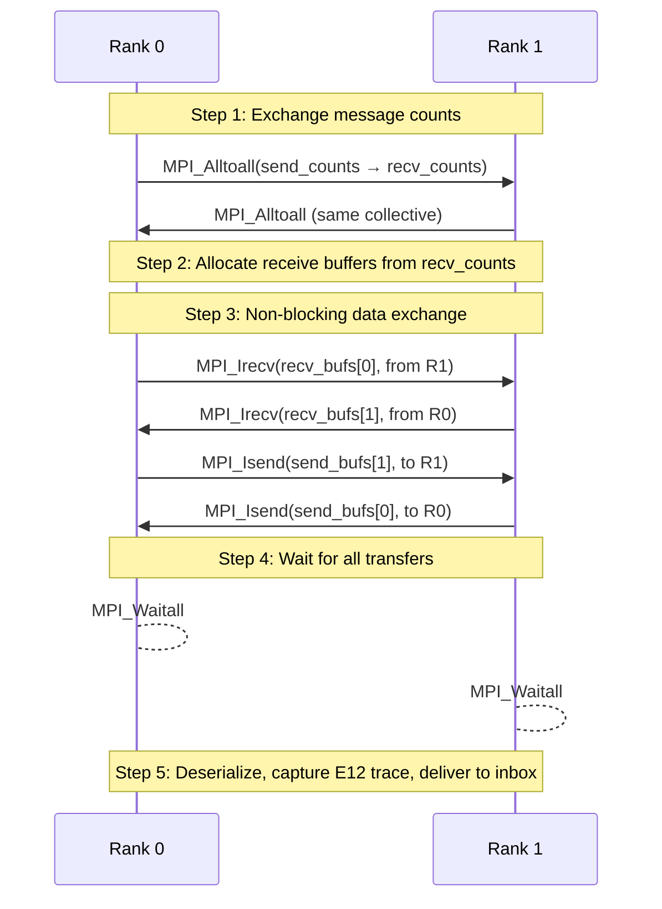
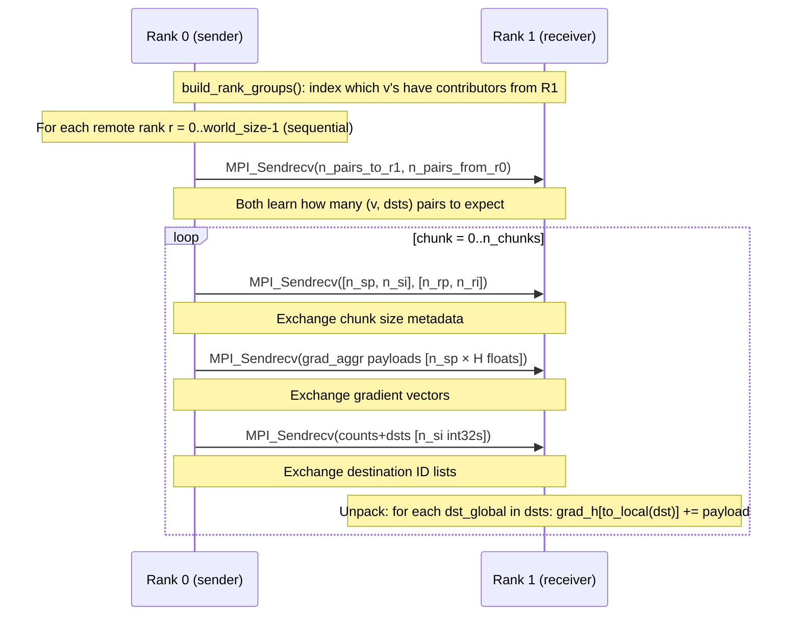

# 05 — MPI Communication

> See also: [01_ARCHITECTURE.md](01_ARCHITECTURE.md) | [06_FORWARD_PASS.md](06_FORWARD_PASS.md) | [07_BACKWARD_PASS.md](07_BACKWARD_PASS.md)

---

## Overview

The system uses three distinct MPI communication patterns, each serving a different purpose:

| Pattern | When | File | Collective |
|---|---|---|---|
| **Forward exchange** | After each Scatter phase | `mpi_exchange.cpp` | `MPI_Alltoall` + `MPI_Isend`/`Irecv` |
| **Gradient transport** | During backward (E14) | `gradient_exchange.cpp` | `MPI_Sendrecv` per rank pair |
| **Gradient averaging** | Before optimizer step (E8) | `distributed_optimizer.cpp` | `MPI_Allreduce` |

Additionally, there are **diagnostic collectives** (MPI_Allreduce used only for debug printing) scattered in `superstep.cpp` and `trainer.cpp`. These are temporary instrumentation, not production logic.

---

## MPI Initialization

```cpp
// main.cpp
MPI_Init(&argc, &argv);
MPI_Comm_rank(MPI_COMM_WORLD, &mpi_rank);
MPI_Comm_size(MPI_COMM_WORLD, &mpi_size);
// ...
MPI_Finalize();   // at shutdown
```

All communication uses `MPI_COMM_WORLD`. No sub-communicators are used.

All MPI collectives are called globally — **every rank must call every collective in the same order**. Any rank that skips a collective causes a deadlock. This is enforced by:
- The `global_active` check in `Runtime::run()` — all ranks exit the layer loop simultaneously
- The BUG 1 fix in training — zero-loss ranks still call `MPI_Allreduce`

---

## Pattern 1 — Forward Message Exchange (`mpi_exchange.cpp`)

This is the most complex pattern. It runs once per GNN layer per epoch.

### Protocol



### Wire Format

Each message is serialized as a contiguous float array of stride `(2 + H)`:
```
slot[0]      = src  (int32 bits interpreted as float via memcpy)
slot[1]      = dst  (int32 bits)
slot[2..H+1] = payload (H float32 values)
```

All messages destined for rank `r` are packed into a single contiguous `send_bufs_[r]` buffer. Recipients allocate `recv_bufs_[r]` based on `recv_counts[r]` from `MPI_Alltoall`.

### E12 Capture Window

Inside `wait_and_unpack()`, immediately after deserialization and before `recv_bufs_.clear()`:

```cpp
if (trace != nullptr) {
    trace->remote_contributors[local_dst].push_back(m.src);
}
// ...
recv_bufs_.clear();   // ← m.src is now permanently lost
```

This is the only point in the entire program where the global sender ID of a remote message is available. After `recv_bufs_.clear()`, this information cannot be recovered.

### Local Messages

Messages destined for the same rank (where `owner_rank(msg.dst) == this_rank`) skip MPI entirely:
- During `enqueue()`: added to `local_pending_` (not `remote_pending_`)
- During `wait_and_unpack()`: delivered directly to inbox after remote processing

### Single-Rank Shortcut

```cpp
void MPIExchange::exchange() {
    if (world_size_ == 1) return;  // no-op for single-process runs
    // ...
}
```

When `world_size == 1` all messages are local and `exchange()` does nothing.

---

## Pattern 2 — Gradient Transport (E14, `gradient_exchange.cpp`)

This runs during the backward pass, after `loss.backward()` and after `LocalBackwardEngine::scatter_only()`.

### Why Not MPI_Alltoall Here?

The gradient exchange is asymmetric — different ranks send different-sized buffers depending on their local graph structure. `MPI_Alltoall` requires all transmissions to be the same size. Instead, E14 uses **sequential `MPI_Sendrecv` per rank pair**, which allows variable-size payloads.

### Protocol



### Rank-Batching Key Insight

For each local vertex `v` that received from remote rank `r`:
- **Send once:** `grad_aggr[v]` (one vector of H floats) to rank `r`
- **Send index:** all global IDs of u's on rank `r` that contributed to `v`
- **Receive side:** for each u in received index: `grad_h[to_local(u)] += received_payload`

This achieves O(V_r × H) communication instead of O(E_r × H) where V_r < E_r by a factor of ~6× on OGBN-Products.

### Peak Memory

```
send buffers + recv buffers ≤ 2 × chunk_pairs × H × sizeof(float)
Default: 2 × 200,000 × 256 × 4 = ~410 MB during exchange
After exchange: buffers freed
```

---

## Pattern 3 — Gradient Averaging (E8, `distributed_optimizer.cpp`)

Simple and symmetric: every rank participates, every rank gets the same result.

```cpp
void DistributedOptimizer::average_gradients() {
    auto params = model_.parameters();
    for (auto& p : params) {
        if (!p.grad().defined()) continue;
        MPI_Allreduce(
            p.grad().data_ptr<float>(),   // sendbuf (in-place would use MPI_IN_PLACE)
            p.grad().data_ptr<float>(),
            p.grad().numel(),
            MPI_FLOAT, MPI_SUM,
            MPI_COMM_WORLD
        );
        p.grad() /= world_size_;
    }
}
```

**Result:** After this call, all ranks have `grad = (sum of all ranks' grads) / world_size`. This is equivalent to computing the gradient on the full dataset seen by all ranks collectively.

**Timing:** Called after all gradient computations (autograd + E13 + E14) and before `optimizer->step()`.

**Called once per epoch, per parameter.** Parameter count:
- 2 GNN layers: `W[H,H]` + `b[H]` each = 2 × (H² + H) parameters
- Classifier: `W[num_classes, H]` + `b[num_classes]`

---

## Diagnostic Collectives (Temporary Instrumentation)

These are **NOT production logic**. They are debug MPI_Allreduce calls added during E14 validation to print global sums of key tensors. They should be removed once validation is complete.

### In `superstep.cpp::run()`

```cpp
double local_norm = cache.aggregated.norm().item<double>();
double global_norm = 0.0;
MPI_Allreduce(&local_norm, &global_norm, 1, MPI_DOUBLE, MPI_SUM, MPI_COMM_WORLD);
if (p.rank == 0)
    printf("[GLOBAL CACHE] layer=%d norm_sum=%f\n", layer, global_norm);
```

**Purpose:** Verify that the total aggregation state is consistent between NP=1 and NP=4 runs. If this sum matches, the forward pass is correct.

### In `trainer.cpp::compute_loss_e13()`

```cpp
// GLOBAL_AGGR_SUM: globally sum the aggregation norm
// GLOBAL_LABEL_SUM: globally sum the label index (should be dataset-consistent)
// GLOBAL_LOGITS_SUM: globally sum the logit norm
// GLOBAL_GRAD_AGGR: globally sum the gradient of last-layer aggregation
```

Each uses `MPI_Allreduce(MPI_SUM)`. These four measurements are the primary diagnostic for the NP=1 vs NP=4 equivalence investigation. See [11_CURRENT_STATUS_AND_BLOCKERS.md](11_CURRENT_STATUS_AND_BLOCKERS.md) for current findings.

---

## Synchronization Points Summary

```
Epoch boundary:
  [no explicit barrier; timing is implicit via collectives]

Per layer (forward):
  1. MPI_Allreduce(local_active)     ← all ranks exit layer loop together
  2. MPI_Alltoall(send_counts)       ← exchange message counts
  3. MPI_Irecv × world_size          ← post receives
  4. MPI_Isend × world_size          ← post sends
  5. MPI_Waitall                     ← block until all transfers complete
  6. MPI_Allreduce (DIAGNOSTIC)      ← aggregation norm (debug only)

Backward (per epoch):
  7. MPI_Allreduce (DIAGNOSTIC)      ← grad_aggr norms (debug only)
  8. MPI_Sendrecv × world_size       ← E14 gradient transport (sequential ranks)
  9. MPI_Allreduce × num_params      ← E8 gradient averaging

Total barrier-like synchronizations per epoch: 2 + 5L + 1 + 1 + P
  where L = num_layers, P = num_parameters
```

---

## Cross-References

- Forward pass context for Pattern 1 → [06_FORWARD_PASS.md](06_FORWARD_PASS.md)
- Backward gradient transport details → [07_BACKWARD_PASS.md](07_BACKWARD_PASS.md)
- Validation of NP=1 vs NP=4 → [11_CURRENT_STATUS_AND_BLOCKERS.md](11_CURRENT_STATUS_AND_BLOCKERS.md)
